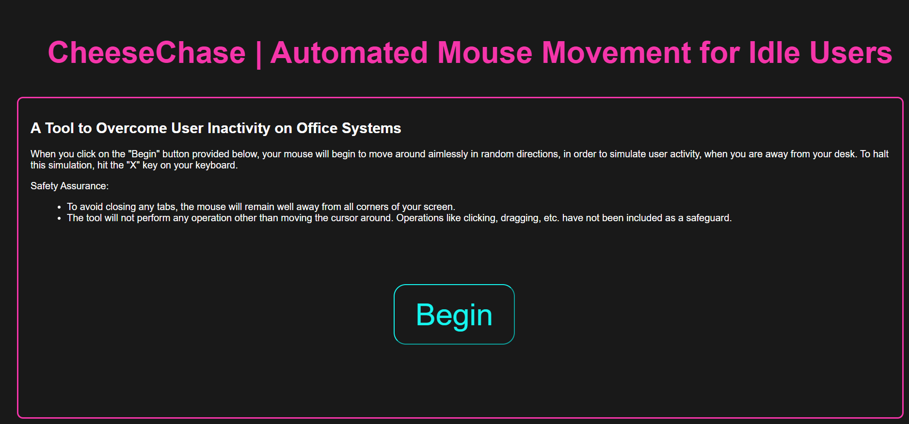

# CheeseChase - A Website to Automate Mouse Movement
CheeseChase is a tool designed to overcome user inactivity on office systems. It provides automated mouse movement to simulate user activity when the user is away from their desk. This helps prevent systems from going idle and maintains the appearance of an active user.
The tool presents a simple web interface with a "Begin" button. When the user clicks the "Begin" button, the mouse starts moving randomly on the screen. The simulation can be stopped by pressing the "X" key on the keyboard.

Safety measures are implemented to ensure a smooth experience:
* The mouse cursor remains away from the corners of the screen to avoid accidentally closing any tabs.
* The tool only moves the cursor and does not perform any other operations like clicking or dragging for added security.

# Languages and Frameworks/Libraries
The languages used in this project are:
* **Python:** The main programming language used for the backend logic.
* **Flask:** A Python web framework used to create the web application.
* **HTML, CSS, JavaScript, AJAX:** Used for creating the user interface and handling client-side interactions.

The libraries used are:
* **pyautogui**
* **random**

# Installation and Execution
1. Clone the repository to your local machine.
2. Install the required dependencies by running the following command:
```
pip install flask pyautogui
```
3. Run the application using the following command:
```
python app.py
```
4. Open *http://localhost:5000* to access the CheeseChase interface.

# Configuration
1. Upon accessing the CheeseChase interface, read the instructions and safety assurances provided.
2. Click the "Begin" button to start the automated mouse movement simulation.
3. The mouse cursor will begin moving randomly on the screen.
4. To stop the simulation, press the "X" key on your keyboard.

# Snapshots
## Home Page Screenshot


# Conclusion
CheeseChase is a simple and effective tool for simulating user activity and preventing system inactivity during periods of user absence. By keeping the mouse cursor moving, it helps maintain the appearance of an active user, ensuring uninterrupted system operations. Feel free to customize and adapt the tool to your specific requirements.

Please note that the tool focuses solely on mouse movement simulation and implements safety measures to avoid any unintended actions.
